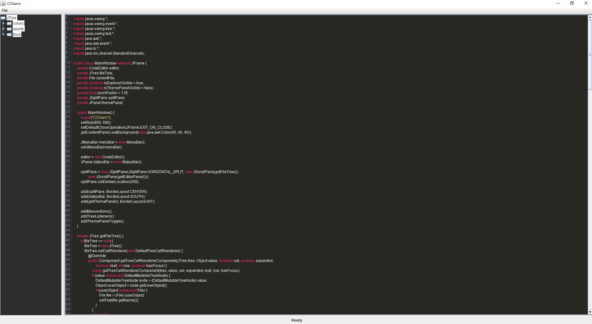

# CCharm: The Ultimate Developer's IDE
Welcome to **CCharm—an** innovative and powerful Integrated Development Environment (IDE) tailored for developers working with C/C++, Java, and Lua. CCharm brings together the functionality and sophistication of modern IDEs with a sleek, user-friendly design to supercharge your productivity.

## Features
- Language Support: Seamlessly code in C/C++, Java, and Lua with full syntax highlighting and intelligent autocompletion.

- Code Snippets: Speed up your development with customizable code snippets for repetitive tasks.

- Project Management: Easily manage your projects with built-in support for project templates like CMake and Gradle.

- Debugger: Integrated debugging tools to help you catch and fix errors early.

- File Explorer: Effortlessly navigate your project files with an intuitive file explorer.

- Theme Customization: Personalize your workspace with a wide range of themes.

- Line Numbers: View line numbers for easier code navigation and editing.

## Getting Started
### Installation
Download the latest release from our official **website**.

Extract the downloaded zip file to your desired location.

Run *CCharm.jar* to launch the IDE.

## Requirements
- Java Development Kit (JDK) 11 or higher

- Supported operating systems: Windows, macOS, Linux

## Usage
- Opening a Project
- Click on File > Open Folder or press Ctrl + K.

- Navigate to your project folder and select it.

- The project files will be displayed in the File Explorer on the left.

- Customizing Themes
- Open the Theme Search panel by pressing Ctrl + P.

- Browse through available themes and select the one you like.

- Apply the theme to see instant changes in your IDE's appearance.

- Saving Files
- To save your current file, press Ctrl + S.

- The file will be saved in UTF-8 encoding.

## Contributing
We welcome contributions from the community! Here’s how you can get involved:

- Fork the repository on GitHub.

- Create a new branch for your feature or bug fix.

- Commit your changes and push them to your fork.

- Open a pull request and provide a detailed description of your changes.

## License
This project is licensed under the MIT License. See the LICENSE file for more details.

## Acknowledgements
We would like to extend our gratitude to all the developers and contributors who have supported CCharm’s journey. Together, we are crafting an epic tool for developers around the world.

**Experience the future of coding with CCharm. Download now and take your development to the next level!**